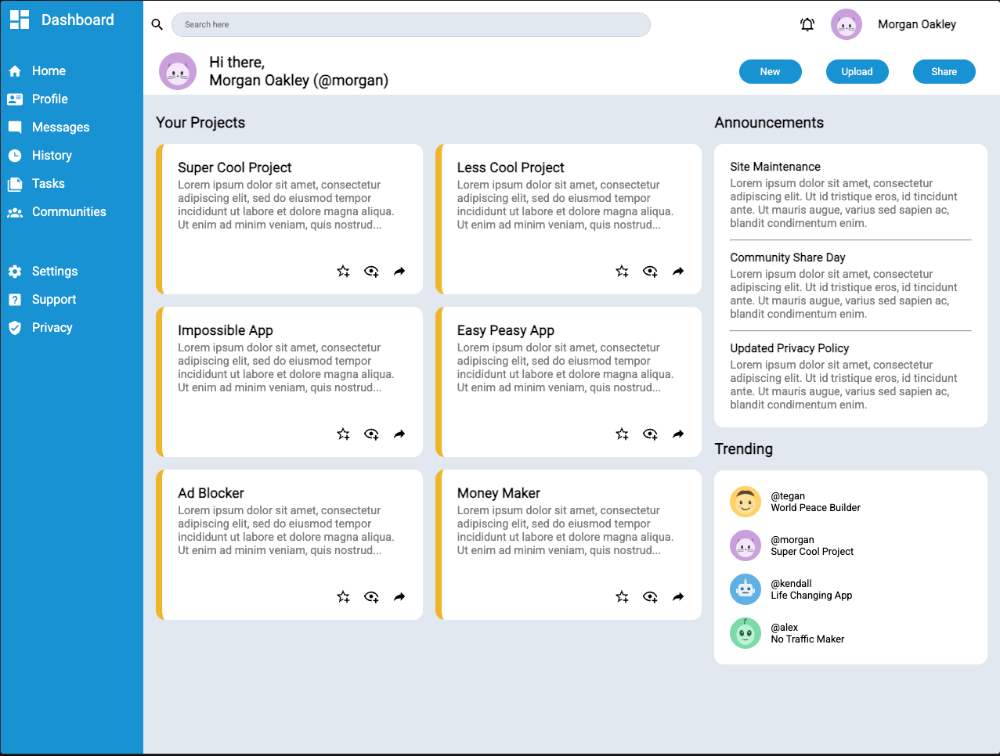

# Admin Dashboard

A responsive-ish admin dashboard UI built with HTML and CSS, using nested CSS Grid and Flexbox layouts. This was a project from [The Odin Project's](https://www.theodinproject.com/) Intermediate HTML and CSS course, focused on practicing more advanced layout techniques through grids-within-grids.


**[Live Demo](https://anthonyc20b.github.io/odin-admin-dashboard)**

---

## Screenshot Reference


---

## Screenshot Final Product



---

## About This Project

The goal wasn't to build something responsive, it was to practice structuring a complex layout with CSS Grid and Flexbox, and get comfortable nesting grid containers within grid containers from the ground up. The Odin Project provides a reference design, and this build is a close recreation of it.

I started by wireframing the structure in HTML. The sidebar, header, and main-content as the three top-level containers, before applying any styling. From there, I built out the base grid for each section, then went section by section nesting additional grid and flex containers to lay out the internal content. Colors, fonts, SVG icons, and final content were layered in last, once the structural skeleton was solid.

The layout is split into three main sections:
- **Sidebar** — icon-and-label navigation (Home, Profile, Messages, History, Tasks, Communities, Settings, Support, Privacy), laid out with its own internal grid
- **Header** — search bar, notification bell, user avatar, and pill-shaped action buttons (New, Upload, Share), laid out with a nested grid
- **Main content** — a "Your Projects" card grid, an "Announcements" panel, and a "Trending" panel with user avatars, each using their own grid structure

## Features

- Layout built entirely with nested CSS Grid containers (grids inside grids)
- Flexbox used for smaller-scale alignment within components
- SVG icons from [Material Design Icons](https://pictogrammers.com/library/mdi/) for navigation links and card actions
- Google Fonts (Roboto) for typography
- Semi-responsive behavior — the layout can flex and adjust down to a point

## Built With

- HTML5
- CSS3 (Grid & Flexbox)
- Google Fonts
- SVG icons (Material Design Icons)

## What I Learned

This project was my first real practice with nesting CSS Grid containers inside other grid containers, rather than relying on one flat grid for the whole page. Breaking the layout into independent sections (sidebar, header, main content) and giving each one its own internal grid made the CSS much easier to reason about than trying to manage everything from a single top-level grid.

I also got more comfortable deciding when to reach for Grid versus Flexbox. Using Grid for two-dimensional layout (like the overall page structure and the card grid) and Flexbox for simpler one-dimensional alignment (like spacing out icons within a card).

## Known Limitations

- **Responsiveness is limited.** This wasn't a goal of the exercise. The layout can adjust somewhat as the browser resizes, but breaks below a certain width. A fully responsive version would need media queries and a restructured mobile layout, a natural next step.

## Running Locally

```bash
git clone https://github.com/anthonyc20b/odin-admin-dashboard.git
cd odin-admin-dashboard
```

Then open `index.html` in your browser.

Or just use the **[Live Demo](https://anthonyc20b.github.io/odin-admin-dashboard)**

## Acknowledgments

Project brief and reference design provided by [The Odin Project](https://www.theodinproject.com/lessons/node-path-intermediate-html-and-css-admin-dashboard).